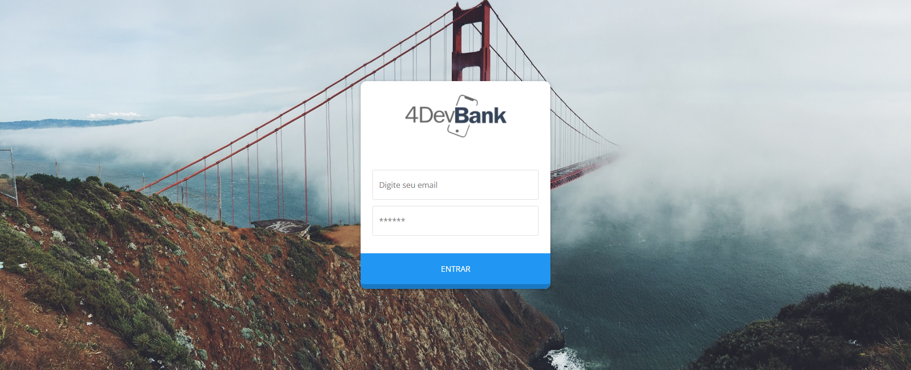
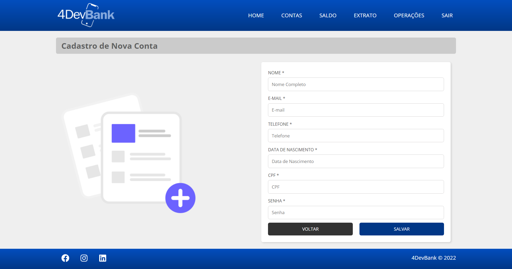

Projeto final de curso da **Trade4Devs**

Desafio: __Criar um portal web para contas digitais, com:__
* Tela de Login
* Tela de OnBoard com:
    * Saldo
    * Extrado
    * Operações
    * Cadastro de Contas

### Tecnologias:

* HTML
* CSS
* ReactJS
* React Router DOM
* Axios (consumo de APIs)

### Instalação:

01. `git clone https://github.com/e-evaristo/4dev-bank.git`
02. `cd 4dev-bank`
03. `yarn` ou `npm install`
04. `yarn start` ou `npm start`

### Screenshot

